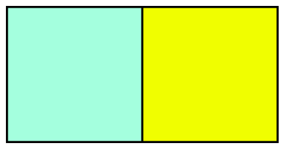
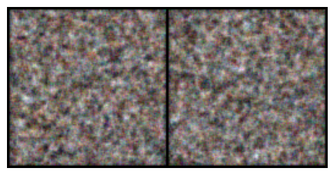
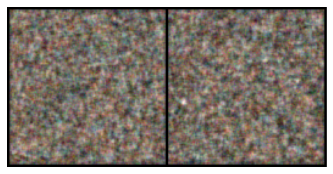

# RealNVP: Real-valued Non-Volume Preserving Flows

A PyTorch implementation of RealNVP from scratch, trained on the CelebA dataset. This model uses normalizing flows to map a standard Gaussian distribution to the complex distribution of face images through a series of invertible transformations.

## Architecture

- **Affine Coupling Layers**: Bijective transformations that split the input into masked and unmasked components for identity and affine mapping.
- **Internal Network**: Convolutional layers with Weight Normalization and ReLU activations to parameterize the scale and shift functions.
- **Masking Strategy**: Checkerboard masking to ensure spatial dependencies are captured across layers.
- **Stability**: Implements `tanh` scale constraints and zero-initialized final layers to prevent gradient explosion and density collapse.
- **Dequantization**: Uniform noise added during training to transform discrete pixel values into a continuous distribution.

## Project Structure

```
├── main.py                # Entry point with argument parsing and training loop
├── model/
│   ├── norm-flows.py      # RealNVP container with coupling layers
├── utils/
│   ├── dataloader.py      # CelebA dataset loader with dequantization logic
│   ├── engine.py          # Training logic and NLL evaluation
└── logs/                  # Generated samples saved here after each epoch
```

## Usage

Place CelebA images (`.jpg`) in `data/`, then run:

```bash
python main.py --epochs 3 --batch_size 4 --hidden_dim 256 --num_layers 4 --device mps
```

### Arguments

| Argument | Default | Description |
|---|---|---|
| `--dataset_path` | `data/` | Path to image directory |
| `--batch_size` | `4` | Batch size |
| `--grad_steps` | `1` | Gradient accumulation steps |
| `--epochs` | `3` | Number of epochs |
| `--lr` | `0.0001` | Learning rate |
| `--hidden_dim` | `256` | Hidden channels in coupling networks |
| `--num_layers` | `4` | Number of affine coupling blocks |
| `--grad_clip` | `1.0` | Gradient clipping max norm |
| `--device` | `mps` | Device (`cpu`, `cuda`, `mps`) |
| `--savepath` | `logs/` | Where to save generated images |
| `--dataset_num_subset` | `50000` | Subset of data to use for training |

## Output

Generated samples are produced by sampling $z \sim \mathcal{N}(0, I)$ with the same spatial dimensions as the training data (e.g., $128 \times 128 \times 3$) and passing it through the inverse mapping of the flow.

<p align="center">
  <strong>Epoch 0</strong><br>
  <br><br>
  <strong>Epoch 1</strong><br>
  <br><br>
  <strong>Epoch 2</strong><br>
  
</p>

> This implementation focuses on the mathematical foundations of Normalizing Flows. Due to the high dimensionality of $128 \times 128$ images, negative log-likelihood values may reach large magnitudes; this is expected as the model concentrates probability density. This code serves as a proof of concept for invertible generative architectures.

# LICENSE
MIT